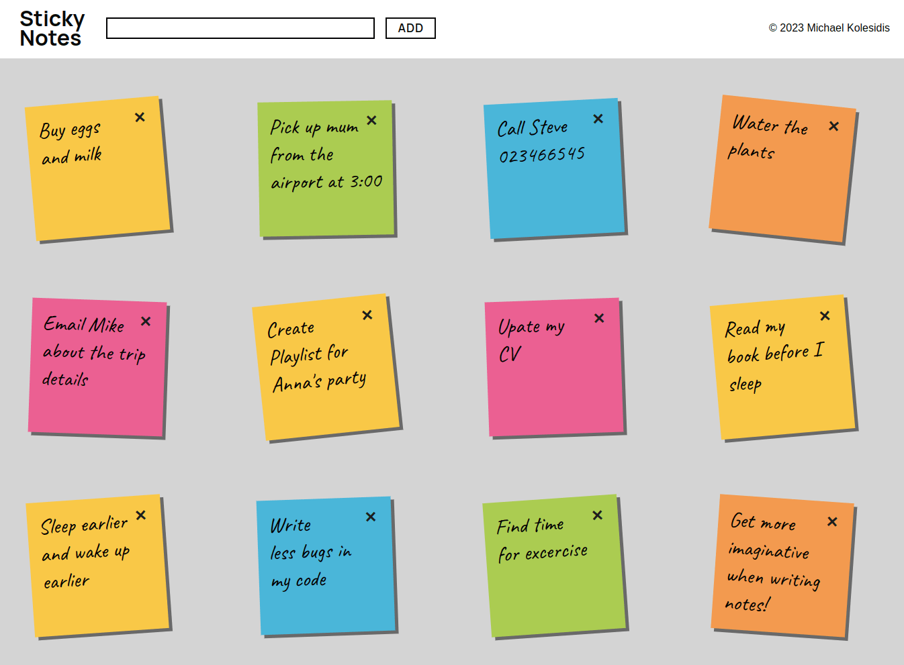

# Sticky Notes

#### Fill your screen with sticky notes of various colors

[**Try me!**](https://sticky-notes-ts.vercel.app/)

## Technologies Used

&nbsp;&nbsp;&nbsp;&nbsp;&nbsp;&nbsp;

&nbsp;&nbsp;&nbsp;&nbsp;&nbsp;&nbsp;

&nbsp;&nbsp;&nbsp;&nbsp;&nbsp;&nbsp;

## Description

A simple app featuring post it notes of various colors. Each note is an object. Notes are saved in local storage an retrieved on load. Notes can be edited and edits are saved as well.

Note: This is one of my very first projects (and it shows 😛) .

## License

Copyright (c) 2023 Michael Kolesidis 
Licensed under the [GNU Affero General Public License v3.0](https://www.gnu.org/licenses/agpl-3.0.html).
